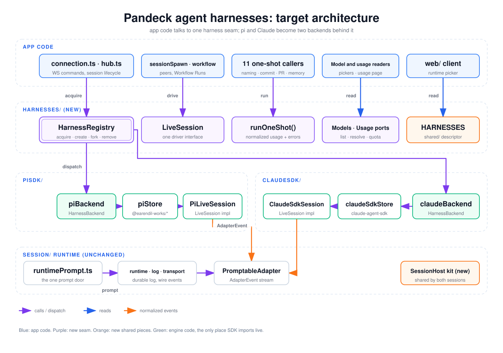

# Agent harnesses

A harness is the engine that runs a session: `pi` (the `@earendil-works/*` SDK)
or `claude-sdk` (`@anthropic-ai/claude-agent-sdk`). This document is the
contract for how app code reaches a harness, and the migration that moves the
server from two hand-wired engines to one seam with two backends behind it.

The migration landed as a series of small pull requests: the "Target" section
describes the architecture they produced, and "Status" records the steps.

## Vocabulary

- **Harness** (`Harness` in `app/shared/harnesses.ts`): which engine runs a
  session. Persisted on the session row; never changes for a session.
- **Persona** (`AgentType` in `app/shared/protocol.ts`, field `agentType`): the
  system prompt and toolset a session presents (`assistant`, `developer`, …).
  Independent of the harness: every persona runs on either engine.
- **Backend**: one engine's implementation of the harness seam. It owns the
  engine's session store, model catalog, one-shot runner and usage query.
- **Account provider** (`claude`, `openai-codex`): which kind of credential
  profile a harness signs in with.
- **Model provider**: the provider id a model picker reports (`claude-sdk` for
  Claude models, the pi provider id otherwise).

## Target

Four layers, each depending only on the ones below it:

1. **App code** (`connection.ts`, `hub.ts`, `sessionSpawn.ts`, `workflow/`, the
   one-shot callers, model and usage readers, the web client) names no engine.
   It asks the seam for a session, a model list or a one-shot run, and branches
   on capabilities, never on a harness id.
2. **`harnesses/`** is the seam and the only module that imports both backends:
   - `harnessRegistry` (`harnesses/registry.ts`) resolves a session id to the
     store that holds it: it lists what both hold resident, finds a resident
     session, opens one by id, and wires both stores to the hub's behaviour
     (`HarnessHost`). Each engine answers through one `HarnessSessions` entry,
     so routing is a lookup by harness id, never a branch per method. An id
     belongs to one engine: a client-supplied id another engine holds is refused
     before anything is written for it (`otherHolder`), which lets a resident
     lookup answer from memory alone. Every new session is created through
     `createSession` (below) and forked through `prepareFork` (below); a rename
     (`harnessRegistry.rename`, which validates the title) and a delete's engine
     half (`harnessRegistry.remove`: dispose, then delete what it stored,
     Claude's native transcript in the background) go to the engine entry too,
     while a delete's harness-neutral cleanup runs in one flow for both, each
     step best-effort once the row is tombstoned. That cleanup deletes the
     session's tool-output artifacts whichever engine held it, so a fork's links
     into its deleted parent's artifacts stop resolving. The merged session list
     across both stores is `harnesses/sessionList.ts`'s; the hub only decides
     when it is rebuilt and who hears it. Two pi-only operations sit on the
     registry too: reopening by transcript file (`reopenTranscript`, a
     post-reload continuation) and an image from a transcript
     (`transcriptImage`).
   - `firstSendEngine` (`harnesses/firstSend.ts`) is what a session's first send
     asks of its engine. `Connection.handleFirstSend` runs one flow for both —
     view claim, persona guard, worktree, session context, genesis card, context
     links, the prompt — and the engine answers only what differs: whether it is
     switched off (`disabled`), whether the client's id becomes the session's
     (`takesClientId`, which the view claim then names), whether that id may be
     taken (`admitId`), which persona gate applies (`personaGate`; the guard
     itself stays in `connection.ts`), the account (`account`), what it resolves
     before a worktree is provisioned (`prepare`, pi's model), and how it brings
     the session live (pi mints its id and freezes the prompt evidence inside
     creation; Claude takes the client's id, links the worktree and freezes
     first), through `createSession`.
   - `createSession` (`harnesses/create.ts`) is the one place that knows each
     engine's creation sequence; a caller names what the session starts with
     (`NewSession`: persona, model, account, cwd and worktree, prompt evidence,
     title) and keeps its own admission and model resolution. It calls the
     stores directly, never `hub.ts`. Every session it creates has its current
     library skills frozen before its first query, whichever engine runs it. A
     worktree named without its path runs where its edge resolves, the same for
     both engines and as a reopen would: in its checkout when that is live, else
     in the app CWD (a workflow coordinator planning a recovery). A Claude
     session's id is checked against every other holder right before its
     registration, with nothing awaited in between: with the disk scan for an id
     the caller names (a client's, or spawn's and the workflow's minted ones),
     from memory and the row for one it mints itself. A Claude id that already
     holds a session reopens it: its stored settings win, while the worktree
     link and title still apply. Callers keep resolving a pi model handle
     themselves (`NewSession.model`), so each still branches on the engine for
     that one step. Spawn reaches `create.ts` through a dynamic import, as it
     does `hub.ts`, because `create.ts` → the Claude store → the tool catalog →
     spawn closes a cycle; the worktree merge agent reaches it the same way it
     reaches `hub.ts`.
   - `prepareFork` (`harnesses/fork.ts`) is what a fork asks of the engine that
     holds the parent. The client names OUR log entry; each engine translates it
     into its own native cut (Claude slices its transcript inclusively, pi
     branches from the entry and needs our log cut to match its turn end) and
     refuses one it cannot make before anything is written. It hands back the
     step that forks, which also carries the parent's worktree edge to the
     child; the connection keeps the persona guard, the view and the reply.
   - `LiveSession` (`harness.ts`) is the one driver interface every resident
     session implements: the read surface (`HarnessDriver`), prompting through
     the runtime, and what the app changes on it (mode, thinking level, the
     model it carries into a new session). `isLiveSession` tells it from a
     storage-backed view by its `live` marker; an engine-only feature is an
     optional method (`acceptCommitDryRun`, pi only), not an `instanceof` check.
     Compact and clear join it as later steps route them through the registry; a
     rename goes through the registry's engine entry instead.
   - `runOneShot()` (`harnesses/oneShot.ts`) runs a single prompt on whichever
     engine a model slot names and returns one result shape: text and
     `AgentUsage`. A run that failed without writing anything throws
     `OneShotError` (carrying its usage); one that failed after writing text
     returns it with `failure` set, and the caller decides. A timeout or engine
     exception throws a plain error and drops partial text. It records the
     internal usage session itself when asked, for every run that reported its
     usage (so not a timeout).
   - The models port (`harnesses/models.ts`) lists the models the pickers offer
     (`pickerModels`) and an account can run (`modelsForAccount`), answers
     whether an account offers an exact model (`accountOffersModel`), and
     renders a stored session's model (`storedSessionModelOption`). It also
     resolves the pi model handle a pi session is created with
     (`NewSession.model`): on an account (`piModelForAccount`), from the shared
     registry (`piModel`), or for a configured slot with its helper fallback
     (`piModelForSlot`), and re-reads pi's registry (`refreshPiModels`); the
     caller still says what a missing one means. The Claude-only curated options
     sit in `harnesses/curatedModels.ts`, which loads no engine SDK, so row
     projections and the Claude adapter stay cheap: an option by id, the alias a
     model id runs as (`claudeModelAlias`) and the curated ids. The usage port
     (`harnesses/usage.ts`) reads subscription usage per account kind and
     redeems OpenAI reset credits.
   - `harnesses/boot.ts` is what the server's composition root (`index.ts`)
     starts in the engines: pi's tool binaries, its model provider sync, each
     account's model runtime and the OpenAI account login.
   - `harnesses/storage.ts` answers where each engine keeps a session on disk
     from paths alone, loading no store: the `file` a session's ref and list
     item carry (`sessionRefFile`), the engine's own transcript
     (`engineTranscript`) and whether a reopen has what it needs
     (`storedSessionState`). The registry adds what needs the stores: the engine
     and persona a row-less session opens as (`rowlessRef`) and why a stored
     session cannot be opened (`unopenableReason`).
   - `harnesses/availability.ts` says whether an existing session may be opened
     now (`existingSessionRefusal`): a Claude session waits on the Claude SDK
     setting, a pi session on its persona's availability.
   - `harnesses/handoffSession.ts` (`handoffEngine`) is what a review handoff
     asks of the engine it opens a new session on: whether the persona needs the
     existing-session guard, and the account and model checks before
     `createSession`.
   - A session's tool exposure for the Tools inspector is read from
     `tools/sessionToolExposure.ts`, which the engine that runs the session
     registers into; the reader never learns which engine answered.
     `harnesses/piSession.ts` is a type-only pass-through: a commit dry run
     names the pi session types it is recorded on.
3. **Engines** (`piSdk/`, `claudeSdk/`) each export one backend object and are
   the only place their SDK package is imported. Each session class composes a
   shared session kit (`sessionKit/`) instead of carrying a copy:
   `SessionResidency` owns the viewer set and the idle clock, and the engine
   says only when it is idle and how its store releases it. `hostCommandTurn.ts`
   emits a synthetic host-command turn (open, progress, discard, tool output or
   card) to viewers and the runtime adapter alike, while the engine keeps the
   turn's ids, running state and teardown. A host command ends its turn with one
   `finishSyntheticCard`, whichever card it renders. The live display-block
   helpers live in `session/runtime/liveBlocks.ts`.
4. **`session/`**: the runtime, log and transport core and the
   `PromptableAdapter` contract are already harness-neutral and do not change.
   `session/planHint.ts` keeps each engine's Plan reminder in a table keyed by
   harness rather than branching on one.

`HARNESSES` in `app/shared/harnesses.ts` is the one table that maps a harness to
its account provider, its model-picker provider (Claude only; pi models keep
their upstream provider) and its capabilities, today the background-work
backends it may own. `harnessForModelProvider`, `harnessForAccountProvider` and
`accountProviderForModelProvider` translate between the three names; server and
web call them instead of repeating the mapping. Further capabilities join the
table when a later step needs them.

## Rules

- Outside `piSdk/`, `claudeSdk/`, `harnesses/` and `test/`, a module reaches an
  engine folder only through `harnesses/`.
- App code does not compare a harness id against a literal. It reads a
  capability from `HARNESSES`, asks the backend, or looks the engine up in a
  table keyed by harness. A comparison is `==`/`===`/`!=`/`!==` with a
  harness-id literal on either side, a `case` with one, or `.includes()` on an
  array literal holding one.
- The one exception to both is the measurement modules (`promptBudgets.ts`,
  `promptInventory.ts`, `sessionAudit.ts`, `sessionAuditSources.ts`,
  `taskOverhead.ts`): they measure what each engine actually sends or spends, so
  naming the engine is their job. `harnessBoundary.test.ts` names them
  (`MEASUREMENT_MODULES`), pins exactly what each still imports and compares,
  and fails on any other module that appears.
- The test parses every non-test `.ts` module under `app/server/src` (and fails
  if a source with another extension appears there), so comments and unrelated
  strings never count. It does not cover the web client, which reaches no engine
  and reads the shared `HARNESSES` helpers, or scripts outside the server source
  such as `scripts/bun-runtime-probe.mjs`, which imports `piSdk/models.ts` on
  purpose to probe the packaged runtime.
- The pins in that test only shrink. A change that removes an engine import or a
  comparison deletes its entry in the same change, and a measurement module that
  needs neither any more leaves `MEASUREMENT_MODULES`; the test fails on a stale
  entry so the lists cannot drift above reality.
- Unchanged by this migration: SDK packages stay inside their folders
  (`architecture.test.ts`), app prompts go through `runtimePrompt.ts`, app tools
  come from `tools/catalog.ts`, and background work goes through the ports in
  `backgroundWork/backends.ts`.

## Status

| Step | Change                                                                        | State  |
| ---- | ----------------------------------------------------------------------------- | ------ |
| 1    | This contract and the boundary ratchet                                        | landed |
| 2    | Remove leftovers: identity helpers, unused types, stale comments, copied code | landed |
| 3    | One persona type (`AgentType` in `shared/`) replaces three identical unions   | landed |
| 4    | `HARNESSES` descriptor in `shared/`, read by server and web                   | landed |
| 5    | `runOneShot()` and its 10 callers                                             | landed |
| 6    | Models and usage ports                                                        | landed |
| 7    | `LiveSession` interface; no `instanceof` on session classes                   | landed |
| 8a   | Shared session kit: viewers and idle clock (`SessionResidency`)               | landed |
| 8b   | Shared session kit: synthetic host-command turns                              | landed |
| 9    | `HarnessRegistry` over both stores; `hub.ts` stops dispatching by hand        | landed |
| 10   | One first-send path for both harnesses                                        | landed |
| 11a  | `createSession`; the first send creates through it                            | landed |
| 11b  | Spawn and the workflow create through `createSession`                         | landed |
| 11c  | Every other creation caller on `createSession`                                | landed |
| 11d  | Fork, delete and rename through the registry                                  | landed |
| 12a  | Model resolution and engine boot through `harnesses/`                         | landed |
| 12b  | Session storage, availability and connection lookups through `harnesses/`     | landed |
| 12c  | Hub list and pi lookups, a tool-exposure seam, the review-handoff branch      | landed |
| 12d  | Allowlists down to named measurement modules; tighten the `CLAUDE.md` rule    | landed |

Every step has landed; the rules above keep the boundary where the migration
left it.

An id belongs to one engine, enforced in three places. Each store refuses to
register an id the other holds resident (`setHeldElsewhere`, wired by the
registry): the last word, whichever path asks. A Claude first send, the one path
that takes a client-supplied id, refuses an id another engine holds resident, on
record or on disk (`otherHolder`) before it writes anything. `createSession`,
which every creation goes through, checks again with nothing awaited before the
session registers: the disk included for an id its caller names, memory and the
row for one it mints itself, which no transcript can hold.

Out of scope: splitting `ClaudeSdkSession.ts` internally. Step 8 removes its
duplicated plumbing first, which makes that split a separate, smaller change.
